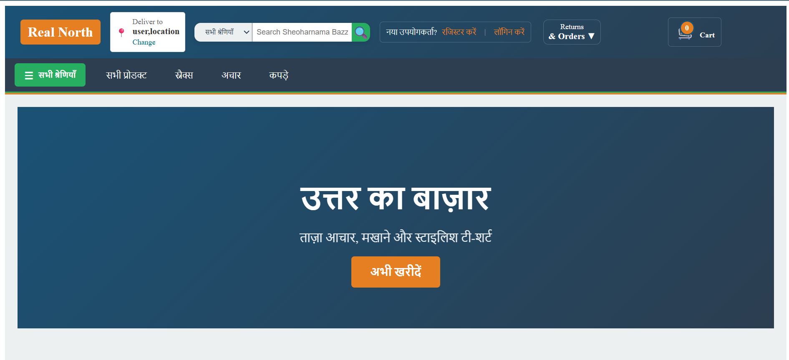
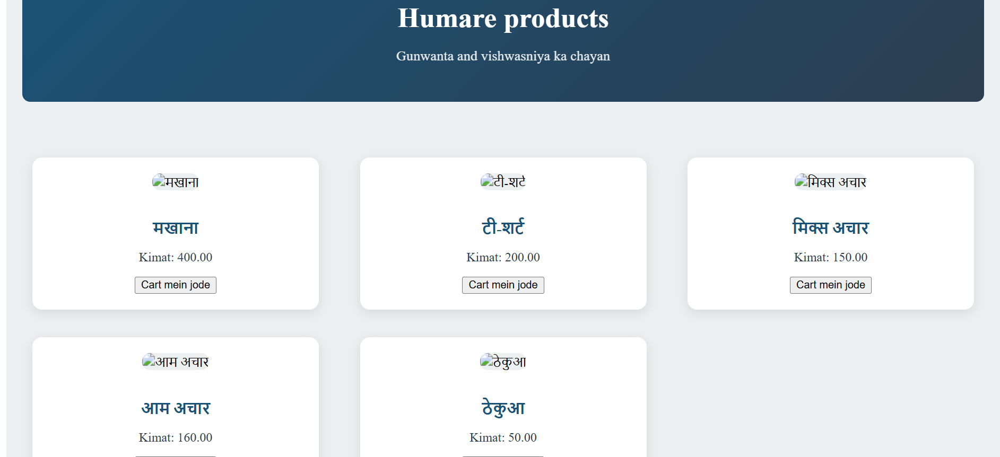

# RealNorth 🌐

**Production-ready Django backend** built with PostgreSQL, DRF APIs, JWT auth, and clean architecture. Demonstrates scalable web application development for real-world deployment.

[](https://www.python.org/)
[](https://djangoproject.com/)
[](https://djangorestframework.org/)
[](https://postgresql.org/)

## 🚀 Live Demo
https://sheoharanama-bazar.onrender.com/
## 🚀 Features

**User Authentication** - Registration, login, password reset
**Product Catalog** - Browse products with categories and search
**Shopping Cart** - Add/remove items, update quantities
**Order Management** - Track orders, view order history
**Responsive Design** - Works on desktop, tablet, mobile
**Admin Dashboard** - Manage products, users, orders
## 📸 Screenshots

| Home Page | Product Detail | Shopping Cart |
|-----------|---------------|---------------|
|  |  |  |

## 🛠 Tech Stack
- **Frontend:** HTML/CSS/JS   
- **Backend:** Django, Django REST Framework  
- **Database:** PostgreSQL  
- **Authentication:** Django Auth / JWT  
- **Static Files:** WhiteNoise  
- **Deployment:** Render   
- **Language:** Python 3.x  

# Quick Start
''' Bash
#  Clone & setup 
git clone https://github.com/rudranshmishra19/RealNorth.git
cd RealNorth

#Virtual environment
python -m venv venv
source venv/bin/activate   # Windows: venv\Scripts\activate

#Install dependencies
pip install -r requirements.txt

# Database setup (postgreSQL)
### Windows -one command install:
```bash
choco install postgresql
#in Psql console:
CREATE DATABASE store_db;
CREATE USER store_user WITH PASSWORD 'password123';
ALTER ROLE store_user SET client_encoding TO 'utf8';
ALTER ROLE store_user SET default_transaction_isolation TO 'read committed';
ALTER ROLE store_user SET timezone TO 'UTC';
GRANT ALL PRIVILEGES ON DATABASE store_db TO store_user;
\q
```env
cp.env.example .env
python manage.py migrate
python manage.py runserver
```
# project Structure
RealNorth/
|-store/ #Main app(api,data,test)
|-mysite/ #project settings
|-static/ #CSS/JS/Images
|-media/ #User uploads
|-env
|-store_analysis
|-final store_analysis
|-requirements.txt
|-manage.py

Api Endpoints
| Method | Endpoint       | Description   |
| ------ | -------------- | ------------- |
| GET    | /api/products/ | List products |
| POST   | /api/cart/add/ | Add to cart   |
| GET    | /api/orders/   | User orders   |
| POST   | /auth/token/   | JWT login     |

License
MIT License
Author
Rudransh Mishra


